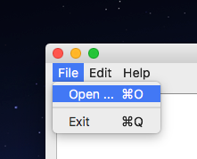
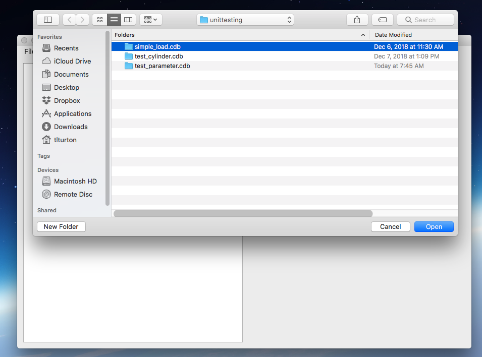
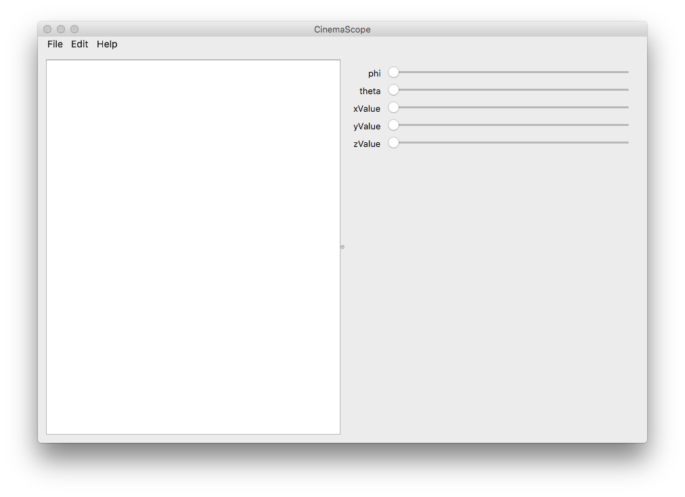
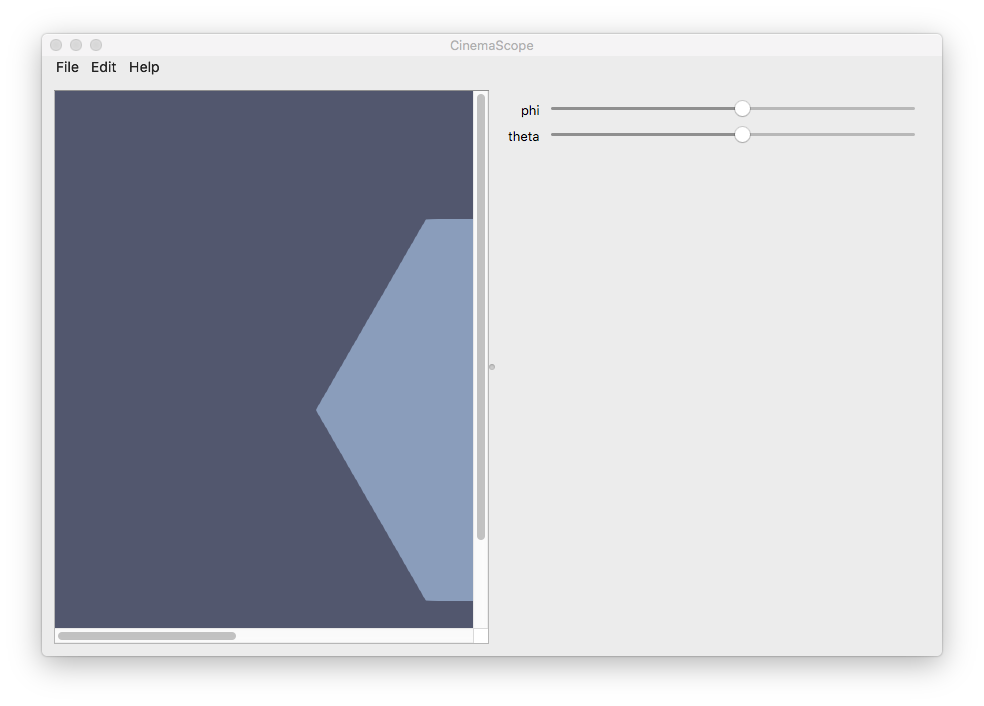
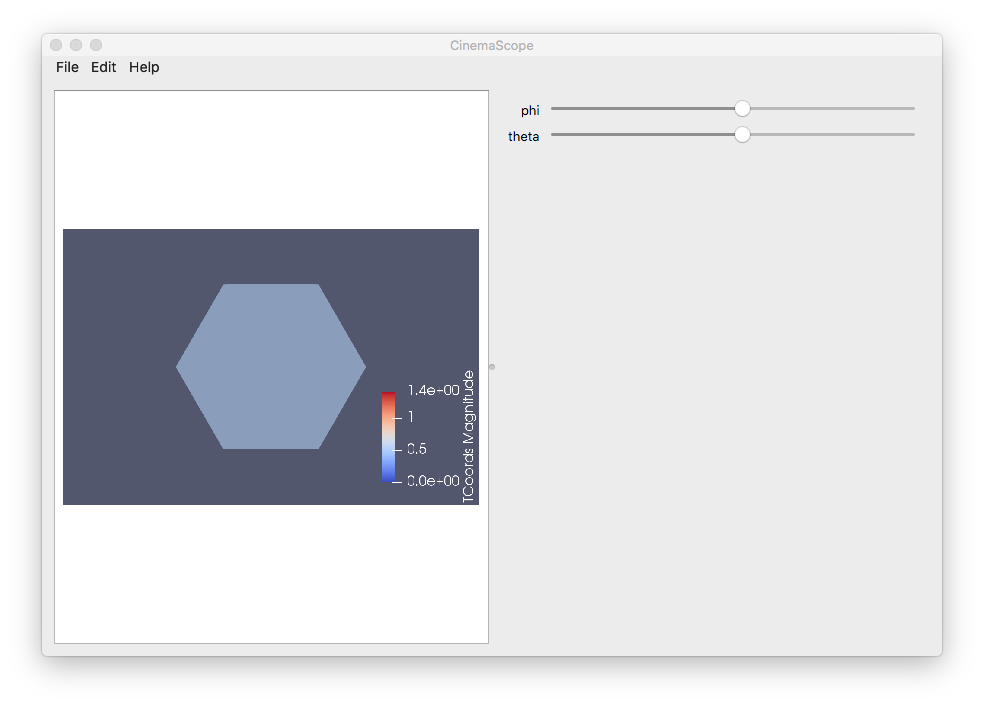
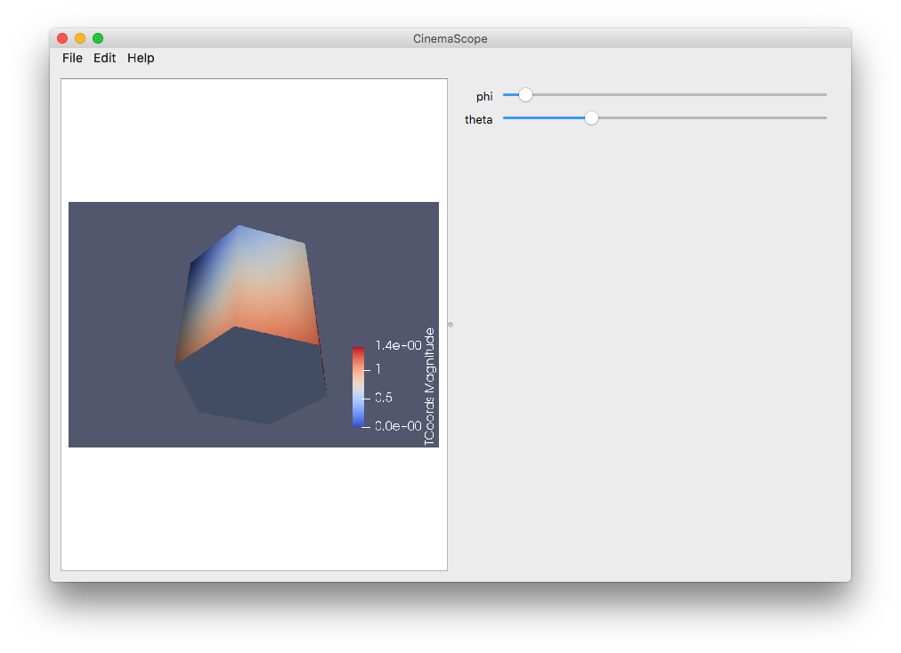
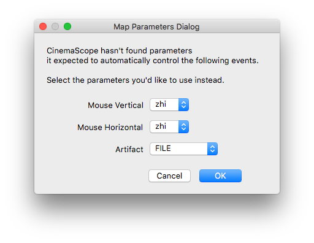

CinemaScope test plan for CDBs with phi/theta/time
---------------------------------------------------


## Download and Install CinemaScope

- Go to https://cinemascience.github.io/cinema_scope

- Download the mac installer (click the link)

- Download the test data set (click the link); unzip into an appropriate directory

- Double click on the mac installer (CinemaScopeInstaller001.dmg) and follow instructions, choosing an appropriate directory for the install

- CinemaScope looks for a settings file in

```
  $HOME/.cinema/scope/settings.ini
```

- This INI-style settings file includes a pointer to the data directory.  Edit **settings.ini** to point to the location of the test data directory:

```
  [cinemascope]
  data=/<path-to-test-data>

```

- Open CinemaScope after it has installed

- Click on File -> Open ... (or &#x2318;O ) to open the data directory and select the data set by highlighting **test_cylinder.cdb** and clicking **Open**.

## Unit Testing

### Test Open/Load with simple_load.cdb database

- Edit **settings.ini** to point to the unittesting/ directory:

```
  [cinemascope]
  data=/<path-to>/cinema_scope/unittesting

```

- Double-click on CinemaScope to open the application.  The GUI will open with an empty image panel on the left and an empty slider panel on the right:


- Click on File -> Open ... (or &#x2318;O ):



- This will bring up a list of databases from the unittesting/ directory.  Select **simple_load.cdb** by highlighting and clicking open (do not click into the CDB directory):



- This database has no images.  If the load succeeds, it will show the five parameters and sliders: phi, theta, xValue, yValue, zValue, but no image.  




### Test Repeat Open/Load; mouse wheel control; slider controls

- Without exiting, click on File -> Open ... (or &#x2318;O ) again and choose **test_cylinder.cdb**.  If the load is successful, it will show the cylinder data set.  The previous data set should be cleared.  




- Test mouse wheel zoom to change image size.  Scrolling up should increase the image size.  Scrolling down should decrease the image size:



- Test slider controls to verify image/slider linkage.  Sliding along phi/theta should rotate through the phi/theta varying images:




### Test parameters dialog and mouse drag controls

- Without exiting, click on File -> Open ... (or &#x2318;O ) again and choose **test_parameter.cdb**.  This database does not have the expected phi/theta parameters.  The **Map Parameters Dialog** should automatically open:



-  Choose to map **zheta** to the **Mouse Vertical** control and **zhi** to the **Mouse Horizontal** control.  Select **OK**.  Verify that dragging the mouse vertically moves the zheta slider top/bottom appropriately.  Verify that dragging the mouse horizontally moves the phi slider left/right appropriately.  This effect should also wrap around.  Note that while this should work regardless of the zhi/zheta setting, it may be easier to see the action by setting zhi/zheta to a central value while testing the opposite control.  


- Click on Edit -> Edit Parameters ... (or &#x2318;E ) and again choose to map **Mouse Vertical** to **zheta**, **Mouse Horizontal** to **zhi**.  Choose **FILE_cylinder** for **Artifact**.  This should bring up the cylinder images.  Again verify that dragging the mouse vertically moves the zheta slider and that dragging the mouse horizontally moves the phi slider.  


